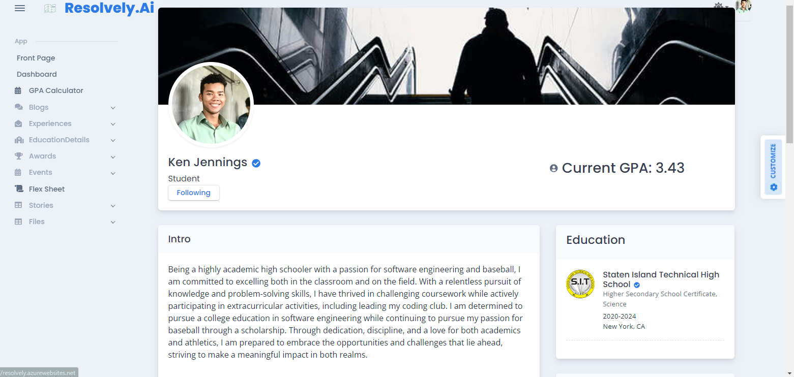
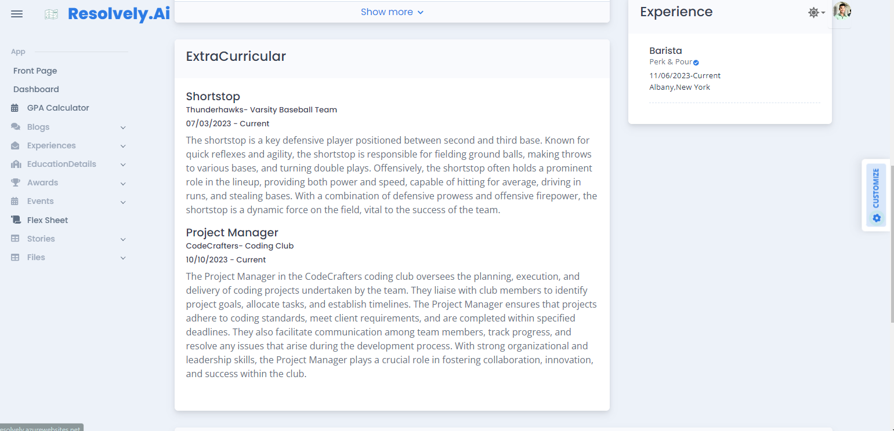
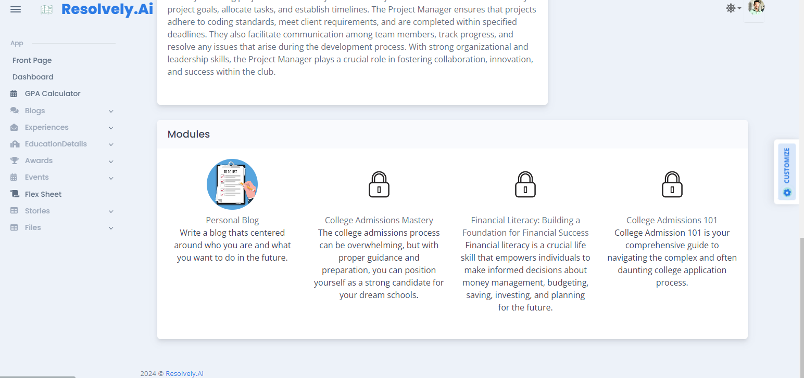
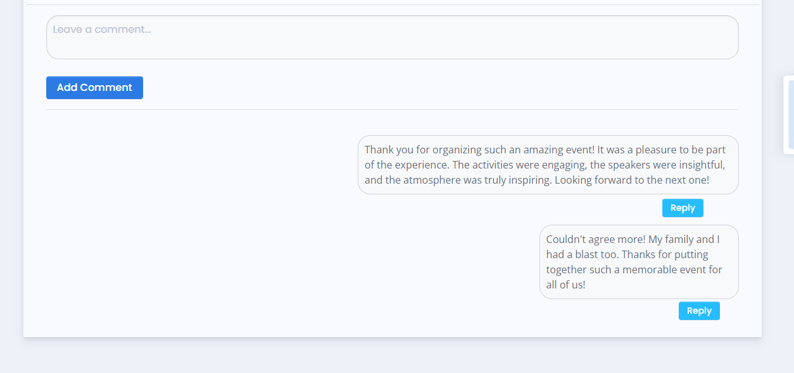
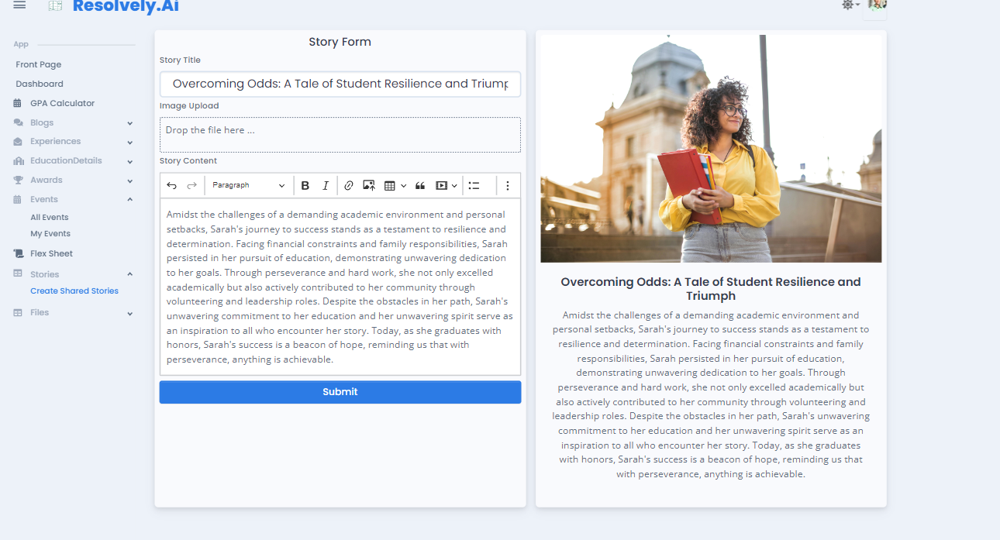
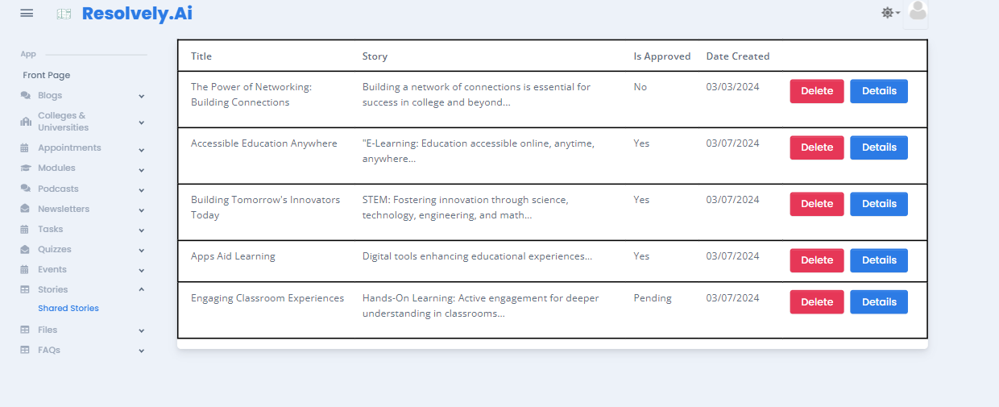
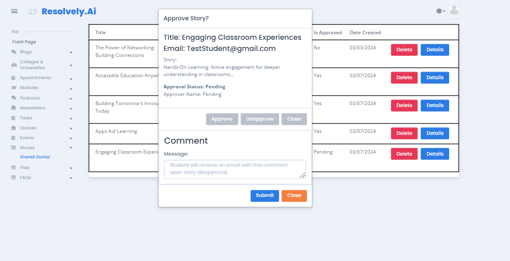

# Projects
selected and approved code snippets from recent projects
## Resolvely

Resolvely is an innovative and interactive platform designed to serve as an academic resource for high school scholars navigating the college
admissions process. Resolvely is a minimum viable product (MVP). This repository contains SQL, .NET, and ReactJS code, with only selected, 
approved snippets shared due to the proprietary nature of the code.

Responsibilities from Resolvely involve building the UI for the student's profile page. The profile page included components representing experience, modules,
about me section, volunteer & work experience and education. These components utilizied Get ajax calls for dynamic data retrieval. Another feature that saw development was
creating a responsive form available to students to submit a story about themselves to the administrator for review. This form included
form validation to prevent the user from submitting a story without including all the necessary information. A card located to the right populated the information in real time to
showcase to the user the data being submitted. A connecting feature I was able to develop was the administrator's story table that displayed all student's submitted story and provided action
items such as delete, view details, approve story and disapprove story. Email services were connected in this table to intiated in the middle teir a custom automated email upon student disapproved
story. Finally, responsibility for completing legacy code for the comment component in order to allow users to leave comments on Events. This component displayed a simple input form to the right of the component and allowed users to leave a comment as well as reply to selected comment. 

- Developed and tested responsive webpages using Bootstrap & React for the Student's Profile and Admin Story Table, implementing
methods such as mapping and filtering to reflect relevant data based on user roles.

- Collaborated with my peer to modify REST client API calls in the front, middle, and back teir for effiecient storing, update, and retrieval of
shared stories data.

- Integrated third-party libraries such as Yup and Formik and implemented data checks through schemas and prototypes to streamline
quality control processes and enhance data accuracy efficiently.

- Analyzed various data sources, including legacy code, data tables, Theme & Figma files, and competitive audits while leveraging team
expertise to inform decisions regarding the information showcased on the Student Profile UI.

- Implemented secure HTTP routes tailored to user roles and page requirements, ensuring seamless navigation within the dropdown and
hamburger menu, and incorporated the display of the student's identification number in the URL.

- Developed a responsive form that populates a card to display the inputted data for the user in real time and send feedback on form status
upon submit through sweetalerts and toastrs.

- Engineered an automated email to send upon admin disapproval of student’s story, streamlining admin processes and facilitating
communication to student through populated student specific data alongside admin comments.

- Leveraged Git, GitHub, Trello, Figma, Slack, and Zoom to streamline coordination for product development tasks. Actively participated in
stand-up meetings, contributed to code reviews, and ensured adherence to weekly quirements in an agile environment.

